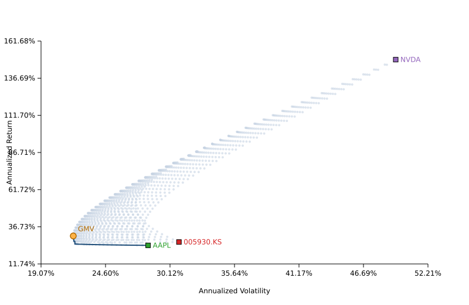

# `temp.csv` 주가 데이터 개요

이 저장소는 삼성전자(005930.KS), 애플(AAPL), 엔비디아(NVDA) 세 종목의 일별 시세를 담은 `temp.csv` 파일과 이를 활용한 효율적 투자 프런티어 분석 스크립트를 포함합니다. CSV는 각 종목마다 시가·고가·저가·종가·거래량을 제공하며, 세 줄짜리 다중 헤더 구조로 정리돼 있습니다.

## 작업 내용 요약

- `temp.csv` 원본 데이터에서 삼성전자·애플·엔비디아 종목의 공통 거래일을 추출하고 일간 수익률을 계산했습니다.
- 효율적 프런티어 탐색 파이프라인(`efficient_frontier.py`)을 구축해 최소분산·최대 샤프·최대 수익 포트폴리오를 산출하고 SVG/JSON 산출물을 생성합니다.
- 분석 결과를 기반으로 한국어 README, 3페이지 분량의 `REPORT.md`, 그리고 정적 웹 대시보드(`docs/`)를 작성했습니다.
- `serve.py` 정적 서버 스크립트를 제공해 로컬에서 웹 대시보드를 바로 확인할 수 있도록 했습니다.

## 실행 방법

1. **분석 재실행**: `python efficient_frontier.py`
   - `docs/data/analysis_summary.json`과 `docs/assets/efficient_frontier.svg`가 갱신되며 콘솔에 핵심 포트폴리오 성과가 출력됩니다.
2. **웹 대시보드 미리보기**: `python serve.py --open-browser`
   - 기본 포트 8000에서 `docs/` 폴더를 서비스하고, 옵션을 생략하면 자동으로 브라우저가 열리지 않습니다.
   - 포트를 바꾸려면 `python serve.py --port 3000`처럼 실행합니다.
3. **보고서 확인**: 루트 디렉터리의 `REPORT.md` 파일을 마크다운 뷰어(GitHub, VS Code 등)로 열어 3페이지 요약을 확인합니다.

## 웹 대시보드

- `docs/index.html`: 효율적 프런티어 결과를 시각화한 단일 페이지 웹사이트입니다. GitHub Pages에 연결하면 즉시 공유 가능한 한국어 리포트로 활용할 수 있습니다.
- `docs/data/analysis_summary.json`: `python efficient_frontier.py` 실행 시 갱신되는 분석 요약 데이터입니다.
- `docs/assets/efficient_frontier.svg`: 동일 스크립트가 생성하는 SVG 그래프를 웹페이지에서 그대로 활용합니다.

### 로컬 미리보기

- `python serve.py` → `http://127.0.0.1:8000/`에서 대시보드를 확인합니다.
- 포트를 변경하려면 `python serve.py --port 3000`처럼 실행하거나 `--open-browser` 옵션으로 브라우저 자동 실행을 활성화할 수 있습니다.
- 표준 라이브러리 기반이므로 추가 의존성 설치 없이 동작합니다. 기존처럼 `python -m http.server`로 `docs/` 폴더를 직접 서빙해도 됩니다.

## 관측 기간과 표본 수

| 종목 | 최초 거래일 | 최종 거래일 | 거래일 수 |
| --- | --- | --- | ---: |
| 005930.KS | 2023-10-16 | 2025-10-10 | 482 |
| AAPL | 2023-10-16 | 2025-10-10 | 499 |
| NVDA | 2023-10-16 | 2025-10-10 | 499 |

> 삼성전자는 한국거래소 휴장일이 미국 증시와 달라 482개의 종가만 확보됩니다. 효율적 프런티어 계산에서는 세 종목 모두가 동시에 거래된 464개 공통 영업일을 사용합니다.

## 종가 기준 성과 요약

- **005930.KS**: 2023-10-16 종가 64,781.67 → 2025-10-10 종가 94,400.00 (총수익률 +45.72%)
- **AAPL**: 176.99 → 245.27 (총수익률 +38.58%)
- **NVDA**: 46.07 → 183.16 (총수익률 +297.59%)

## 일별 요약 통계

### 005930.KS

| 지표 | 평균 | 중앙값 | 최소 | 최대 |
| --- | ---: | ---: | ---: | ---: |
| 시가 | 66,509.00 | 68,872.64 | 49,263.38 | 94,000.00 |
| 고가 | 67,202.08 | 69,490.01 | 50,784.92 | 94,500.00 |
| 저가 | 65,822.65 | 68,408.07 | 48,968.97 | 92,700.00 |
| 종가 | 66,471.53 | 68,812.25 | 48,968.97 | 94,400.00 |
| 거래량 | 19,481,204.69 | 17,577,060.00 | 2,957,915.00 | 57,691,266.00 |

### AAPL

| 지표 | 평균 | 중앙값 | 최소 | 최대 |
| --- | ---: | ---: | ---: | ---: |
| 시가 | 209.29 | 210.92 | 164.17 | 257.99 |
| 고가 | 211.47 | 213.70 | 165.21 | 259.24 |
| 저가 | 207.33 | 209.35 | 162.91 | 256.72 |
| 종가 | 209.52 | 212.02 | 163.82 | 258.10 |
| 거래량 | 56,558,297.39 | 50,036,300.00 | 23,234,700.00 | 318,679,900.00 |

### NVDA

| 지표 | 평균 | 중앙값 | 최소 | 최대 |
| --- | ---: | ---: | ---: | ---: |
| 시가 | 115.59 | 120.32 | 40.43 | 193.51 |
| 고가 | 117.54 | 122.40 | 40.85 | 195.62 |
| 저가 | 113.41 | 117.41 | 39.21 | 191.06 |
| 종가 | 115.60 | 120.67 | 40.30 | 192.57 |
| 거래량 | 325,122,504.81 | 289,680,000.00 | 105,157,000.00 | 1,142,269,000.00 |

## 종목 간 상관관계

464개의 공통 거래일에 대해 산출한 일간 산술 수익률 상관계수는 다음과 같습니다.

| 종목 쌍 | 상관계수 | 공통 거래일 |
| --- | ---: | ---: |
| 005930.KS vs AAPL | 0.112 | 464 |
| 005930.KS vs NVDA | 0.086 | 464 |
| AAPL vs NVDA | 0.374 | 498 |

애플과 엔비디아는 상대적으로 높은 동조화(0.374)를 보였으며, 삼성전자는 미국 상장 종목들과의 동조화가 제한적입니다.

## 효율적 프런티어 분석 개요

- 2023-10-17부터 2025-10-10까지의 공통 거래일(464일) 종가 기준 수익률을 사용했습니다.
- 모든 포트폴리오는 공매도 금지(가중치 ≥ 0) 조건에서 2%포인트 간격으로 가중치를 탐색했습니다.
- 일간 수익률과 변동성을 연 252거래일 기준으로 연율화했습니다.

### 단일 종목 연율화 성과

| 포트폴리오 | 연간 기대수익률 | 연간 변동성 |
| --- | ---: | ---: |
| 005930.KS | 26.49% | 30.88% |
| AAPL | 24.23% | 28.24% |
| NVDA | 149.18% | 49.45% |

### 주요 포트폴리오 하이라이트

| 포트폴리오 | 연간 기대수익률 | 연간 변동성 | 005930.KS | AAPL | NVDA |
| --- | ---: | ---: | ---: | ---: | ---: |
| 글로벌 최소분산 | 30.57% | 21.84% | 44% | 50% | 6% |
| 최대 샤프 지수 (무위험수익률 0%) | 95.26% | 34.43% | 36% | 0% | 64% |
| 최대 기대수익 | 149.18% | 49.45% | 0% | 0% | 100% |

최소분산 포트폴리오는 단일 종목 대비 변동성을 크게 낮추면서도 기대수익을 개선합니다. 엔비디아 비중을 늘릴수록 기대수익이 높아지지만 위험 또한 커지며, 샤프 지수 최적 조합이 균형점 역할을 합니다.

## CSV 헤더 구조

`temp.csv`는 날짜 열 이후 각 종목에 대해 다음과 같은 열 묶음이 반복됩니다.

| 열 묶음 | 설명 |
| --- | --- |
| Open | 해당 거래일 시가 |
| High | 해당 거래일 고가 |
| Low | 해당 거래일 저가 |
| Close | 해당 거래일 종가 |
| Volume | 거래량 |

분석 파이프라인은 이러한 구조를 기반으로 종목별 종가를 추출하고 일간 수익률을 계산합니다.
